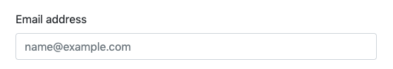

# Building Active Components

## Building Custom Active Components

When writing active components the code blocks are used as follows. Here an illustrative example is given, similar to above, of a component which outputs a heading with the label value and the current date. With active components, however, the Vue.js framework is used to render the component.

 **Vue.js Framework**

Active components are implemented using the Vue.js framework. Vue.js handles the data bindings for each of the fields on the page and syncs data to and from fields when the page is loaded and when it is submitted back to NetSuite. 

Because the components are built and configured in the Honey Forms bundle, there are some specific requirements on how the components are implemented to ensure that components can be configured by users on a point-and-click basis within the Honey Forms bundle on NetSuite. The list of base requirements for Active Components is given below. 

## **Code Blocks**

The following is an overview of the code blocks that make up the component definition. Regardless of weather these are edited and uploaded from a [component definition file](https://www.notion.so/Component-Definition-File-7cd2a959dc25477489e05ba5addc9abf) or input directly into NetSuite, the four different sections remain the same. 

**Template HTML**

When building active components the Template HTML field contains the component template HTML. Vue.js components must have one and only one root element so if the component template has multiple HTML elements, it is generally wrapped in a div element. 

    

        
<label :for="fc.id">{{fc.label}}</label>

        <input :id="fc.id" type="text" v-model="fieldValue" class="form-control" >
    

**Instance HTML**

When writing active components, the Instance HTML field holds the instance of the component tag as it is rendered on the screen in each location that the component is used. For active components the name, id and data are automatically populated. Therefore, the instance HTML will always be the following:

    <{#c:tagName#} :hny-fcid="{#fc:internalid#}" :hny="hny"></{#c:tagName#}>

**Template JavaScript**

For active components the Template JavaScript field also contains the specific Vue.js call to define the component. 

The `c:template` component builder tag is used to merge the Template HTML content into the component definition. When this value is output it will be rendered with back-ticks surrounding the contents. Note in the example below that no enclosing quotes are used as they will be added by the Honey Forms bundle. 

    Vue.component('{#c:tagName#}', {
        props: ['hnyFcid', 'hny'],
        template: {#c:template#},
        data: function () {
            return {
                fc: this.hny.formComponents[this.hnyFcid]
                , local : ""
            };
        }
    });

Any JavaScript added in this section will only ever be written once to the page as long as the component is used at least one time on the page. The Template JavaScript is not "aware" of the form component instance being used and Builder Value Tags can not be used in the Template JavaScript. The exception to this is "c" type tags such as `c:template` as seen above.

**Instance JavaScript**

Instance JavaScript is rendered on the page again each time the component is used on the page. Instance JavaScript is very rarely required and is better handled inside the Template JavaScript with a method that renders on the instance being created.

## **Form Component Configurations**

The form component configurations are stored in the Honey App root instance data under `hny.formComponents`. The config values for each form component are stored there indexed by the form component internal ID. More data on the data structure is available on the [Data Structure page](https://www.notion.so/Forms-Data-Structure-7992cfc58ba44fb8a300de79f8540a06). 

In order to access the form component configurations, one can use the above `hny` and `hnyFcid` props to retrieve the data. This can be accessed in the Template JavaScript or HTML using the following:

    var fc = this.hny.formComponents[this.hnyFcid];

In order to correctly render the component, the Template JavaScript and Template HTML will make fairly heavy use of these configuration values. As there is no need to update these config values client side (unlike data binding values for the actual fields on the record being viewed) it is useful to copy the form component settings from the root data source to the individual component data so that they can be referenced more easily. The convention is to copy the values to a property called `fc` in the component local data. 

The following code snippet shows how this is done. 

    Vue.component('{#c:tagName#}', {
        props: ['hnyFcid', 'hny'],
        template: {#c:template#},
        data: function () {
            return {
                fc: this.hny.formComponents[this.hnyFcid]
            };
        }
    });

This makes referencing form component settings much easier. Without copying the data to a property a label would look like this:

    <label :for="this.hny.formComponents[this.hnyFcid].id">
    {{this.hny.formComponents[this.hnyFcid].label}}
    </label>

When the form component data is copied to the individual component instance as an `fc` data property, it becomes much simpler:

    <label :for="fc.id">{{cf.label}}</label>

In all the requirements listed below for Honey Components the `fc` property will be used to refer to the form component configurations object instead of  `hny.formComponents[##]` where ## would be the specific form component internal ID.

## **Active Component Requirements**

The following are the base requirements which must be implemented for all active components so that the component correctly responds when settings on the Form Component record are changed in NetSuite. 

A user building components for a specific one-time use may choose not to implement all of these but components which are being designed for re-use on multiple forms should conform to these requirements for the best user experience. 

**Example Component**

The following example can be referred to to see how each of the items below are implemented in a single component:

Template HTML

    

        
<label :for="fc.id">{{fc.label}}</label>

        <input :id="fc.id" 
    					type="text" 
    					class="form-control" 
    					v-model="this.hny.data[this.fc.bindTo][this.fc.sourceFieldId]" 
    					:class="fc.classes"
    					:placeholder="fc.placeholder" 
    					:readonly="fc.IsReadOnly" >
    		<small class="form-text text-muted">{{fc.desc}}</small>
    

Instance HTML

    <{#c:tagName#} 
    	:hny-fcid="{#fc:internalid#}" 
    	:hny="hny" 
    	class="{#c:tagName#}"></{#c:tagName#}>

Template JavaScript

    Vue.component('{#c:tagName#}', {
        props: ['hnyFcid', 'hny'],
        template: {#c:template#},
        data: function () {
            return {
                fc: this.hny.formComponents[this.hnyFcid]
                , local : ""
            };
        }
    });

CSS

    .{#c:tagName#} input {
        font-weight: bold;
    }

**Form Component Props**

All Honey Form components must include the following two props: 

- hnyFcid - the form component internal ID is passed in via this prop
- hny - the full root `hny` data object is passed in via this prop

**Component Element Name**

The component element tag name is set dynamically using the `c:tagName` builder tag.

**Template HTML**

The template HTML is embedded dynamically using the `c:template` builder tag

**Class**

The tag name of the template is always included as a top level class in the instance HTML by using `c:tagName.`This makes it possible for any CSS added to the page or to the component to be prefixed and thus applied specifically to that component. 

**CSS**

CSS is always applied globally to the page by the browser so any additional styles needed for the component which are added via the CSS field should always be prefixed using `c:tagName.` This will only work if the  tag name has been included as a class on the outermost element (see Class above). Make sure to use the "." class indicator before the tag name. 

**Label**

The label for components is to be taken from the `fc.label` value. 

Unless a value has been set on the form component record for "Override Display Label" the label will consist of the form component standard "Name" field.

Labels should be added to fields using Bootstrap and HTML conventions which generally looks something like this:

    

        
<label :for="fc.id">{{fc.label}}</label>

        <input :id="fc.id" type="text" class="form-control">
    

**Label Visibility**

Another property `fc.hideLabel` must be used to set the label visibility. This can be accomplished using the `v-if` attributes in the HTML Template (as shown above) to make the rendering of the label conditional. 

**Additional Classes**

Users can add specific classes to component HTML by entering them into the "Additional Classes" and "Additional Group Classes" fields on the Form Component record. These values become available via the  `fc.classes` and `fc.groupClasses` properties. 

The `fc.groupClasses` property is always used to add additional classes to the top-most element in the component template so that the classes apply to all child elements. 

The `fc.classes` values should be applied to the main element or elements in the component such as the text input field as opposed to divs which contain it. 

More complex arrangements with custom classes being injected into the Template HTML can be accomplished with [Custom Settings](https://www.notion.so/Building-with-Custom-Settings-d92dc8279c1f459c84ccafbd8d6341c2). 

Additional classes are added using the `v-bind:class` or just `:class` Vue.js attributes. These can be used along side static classes as follows:

    

        <input :id="fc.id" type="text" class="form-control" :class="fc.classes">
    

**Field Description**

The `fc.desc` property holds descriptive information about the component which can be displayed on the page as a help pop-up, as some sub-text or otherwise. The value for `fc.desc` comes from the "Field Display Description" on the Form Component record. For example:

**Input Field Placeholder**

The `fc.placeholder` property is used to set an input field placeholder inside the input element. The value comes from the "Input Placeholder" field on the Form Component record. For example:

**Data Binding**

Components which render fields which store values can either:

a) do so locally in the component data object if the component does not need to interact with any other components on the screen or submit the data back to NetSuite 

 - OR - 

b) store them in the root data instance for the Honey app

All values stored in the root instance should reside within the `hny.data` object. There are several locations where data can be stored under this object, more specifics on the data structure can be found the [Data Structure](https://www.notion.so/Forms-Data-Structure-7992cfc58ba44fb8a300de79f8540a06) page. 

The primary options are:

- `hny.data.record` for actual fields on the NetSuite record being edited
- `hny.data.form` for values to be sent back to NetSuite which do not directly correspond to a field on the database record being saved.
- `hny.data.var` for temporary values which are not going to be submitted back to NetSuite at all but which need to be accessed by other components on the page.

The bind to location is set on the Form Component record by selecting the "Field Binding". When this value is set it will be available under `fc.bindTo` and will correspond to the location of the data such as "record", "form" or "var". 

The `fc.bindTo` value is used in conjunction with `fc.sourceFieldId` which gives the exact name of the key where the value for the component is stored. The value for `fc.sourceFieldId` is taken from "Source Field ID" on the Form Component record in NetSuite. 

An example of how these are both used is as follows:

    <input type="text" v-model="this.hny.data[fc.bindTo][fc.sourceFieldId]" >

If the bind to value was "record" and the source field ID was set to "entity" on the Form Component record, then the value for this field would be stored under `hny.data.record.entity` which, in this case, would be submitted back to NetSuite to update the record being edited. 

**Mandatory Fields**

Input fields are designated as mandatory by the user by setting the `fc.isMandatory` value to true. This value is taken from the "Field Is Mandatory" value on the Form Component record. If this field is checked, the component must render an error if the form is submitted without a value populated. 

**Read Only Fields**

The "Field Is Read Only" check box on the Form Component record is output as a boolean value as `fc.isReadOnly` and should control weather or not a field is editable on the form. 

For most input elements this can be accomplished in the following manner. Select elements however require a slightly more complex implementation using an alternative version of the element and a `v-if` block. 

    <input :id="fc.id" type="text" :readonly="fc.isReadOnly">

**Transforming Values**

Some fields might require values to be formatted or transformed before they are written back to the `hny.data.record` data object to be submitted back to NetSuite. An example of this are date and time fields which must be retrieved and sent back to NetSuite in a specific format. When this is a requirement, the following configuration should be used. 

[FIGURE OUT WHAT THE HELL WE GON' DO]

**Search List Components**

Search list components have their own rules as there quite a few settings on the Form Component record for configuring search lists. See [Building Search List Components](https://www.notion.so/Building-Search-List-Components-03013c46085a4bdf9e87cfe18e7b15ef) for more information. 

**Sublist Components**

Sublist fields have their own set of rules that must be followed for the component to function correctly. These are covered in another section. 

**Stackable Components**

Stackable components which can be re-used inside of other component templates have additional requirements which are covered on the [Stackable Components](https://www.notion.so/Building-Stackable-Components-2b978058176648a79c3d919cd6e1f909) documentation page.