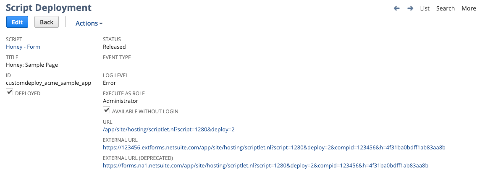
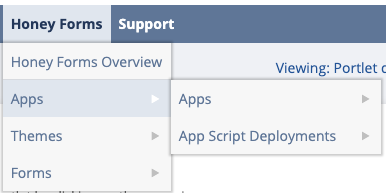
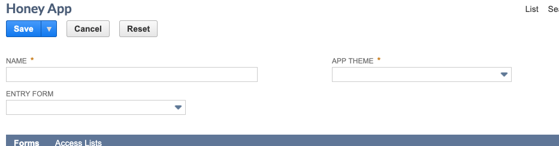
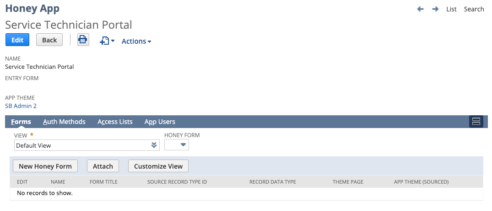
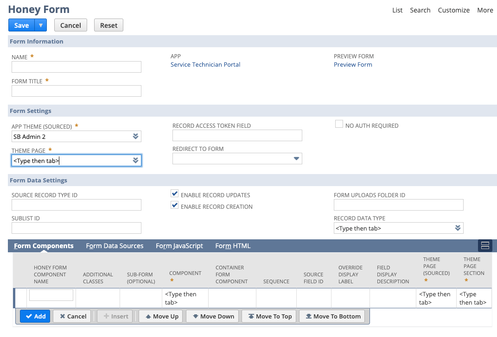
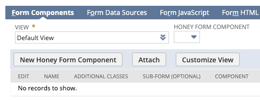
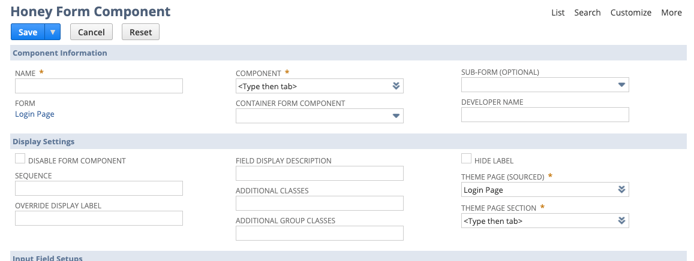
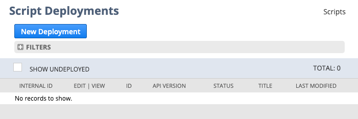
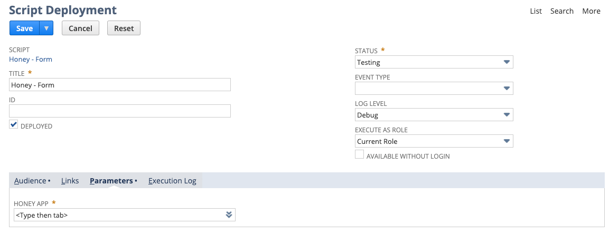

# Creating a Honey App

## What is an App?

For key definitions on Honey Forms including what an App is, see the [Honey Forms Basics](./Honey-Forms-Basics-1cdfc74e-9c2e-4f9d-929c-17dc50fc8e83.md) page. Make sure you are familiar with these basic concepts before continuing. 

## Creating a new App

The steps in creating a first simple App are as follows. These will be covered in detail in the sections below. 

1) Create the App record

2) Create the first form for the App - this will become the landing page

3) Create an App deployment record

A list of Honey Apps can be found under the "Honey Forms" menu in NetSuite. By default this menu is only available on the Classic Center which users with the Administrator role will be able to see. 

### 1. Create the App Record

This step can be done by navigating to:

Honey > Apps > Honey Apps > New

New Honey App Screenshot

Fill out a name for the App - this name is only used internally and will not be visible to individuals logging into the App. 

Choose an App Theme. The theme determines the style of the pages which forms are displayed on. It is generally a good idea to make a copy of one of the existing themes so that it can be customized. But this is not necessary for a first simple app. 

Once the Name and the App Theme are selected, save the App record. We will come back to the App record and set the "Entry Form" field later once we have created a first form. 

### 2. Create the Entry Form

**Form Setups**

To create the first form for the App, go to the App record (you should already be there from the last step) and click on the New Honey Form button. 

This will bring you to the screen to create the first form for the App. The form will already be linked to the App record (as can be seen below). 

A full description of all of the fields and configurations available on a form [can be found here](./Form-Configurations-094dd726-34b6-46a0-aedb-1f7f4fb8fd43.md). But for this first simple example we will just populate the following fields:

**Name**: Sample Form  (this is the internal name of the page)

**Form Title**: Sample Form (this is the external title of the page)

**App Theme**: (should already be defaulted to the theme selected on the App)

**Theme Page**:  (select any theme page)

**No Auth Required: t**rue (The initial login page for an app should always be no-auth)

**Enable Record Updates:** false

**Enable Record Creation:** false

**Adding Form Components**

The next step of creating the form is to add components to the form. For demonstration purposes we will just add some static text.

To do this, navigate to the Honey Form record in view mode and click the "New Honey Form Component" button. 

This will bring you to the Form Component page. Form Component records create an instance of a pre-defined component such as an input field or a table on the form. There are a large number of settings and configurations which exist on this page. For complete details on each of them see the [Form Component documentation here.](./Form-Component-Configurations-f0f20067-5869-49e6-ab42-c3744a9cf0de.md)

For the sample form we are creating, we only need to fill out a few of these fields as follows:

**Name:** Hello World
**Component:** Header H1
**Sequence:** 10
**Theme Page:** (should already be defaulted to the form setting)
**Theme Page Section:** (select any section such as the content section)

Once these fields are filled out, save the form.

Navigate back to the App record. Once there, fill out the "Entry Form" field with the form that was just created. This will be the "landing page" for the App i.e. will be the form the user sees when they navigate to the App  URL. 

### 3. Create A Deployment Record for the App

The final step in creating a new app is to create the deployment record for the App. This is a deployment of a NetSuite Script which is linked to the App record. This is only done once per App. To create the script deployment go to the following menu item:

Honey > Apps > Script Deployments > New

This will bring you to a list of the current App deployment records - at this point there should be none. 

Click "New Deployment". This will bring you to the following screen to create a new deployment. 

Fill out the following fields on the new Script Deployment. Some of these fields are located under the Audience or Parameters sub-tabs.

**Title**: Enter the App name here as defined in step (1) prefix the name with "Honey: " just to make it easy to find the script deployment in the future
**Status:** Released
**Execute As Role:** Administrator
**Available Without Login:** True
**ID:** Leave blank or enter an Internal ID if desired
**Honey App:**  Set this to the App created in step (1)
**Roles Select All** (Checkbox): True

Hit save on the Script deployment when these values are filled out. Once saved, open the deployment which was just created in view mode. 

The deployed script will give the internal and external URLs for the App. This full URL given under "External URL" is the link used to access the App. This URL has to be used in full but a URL shortener service can be used or a redirect can be set-up on a standard web-site create a shorter more memorable URL for users. 

You should now be able to navigate to this link and see the form that was created.